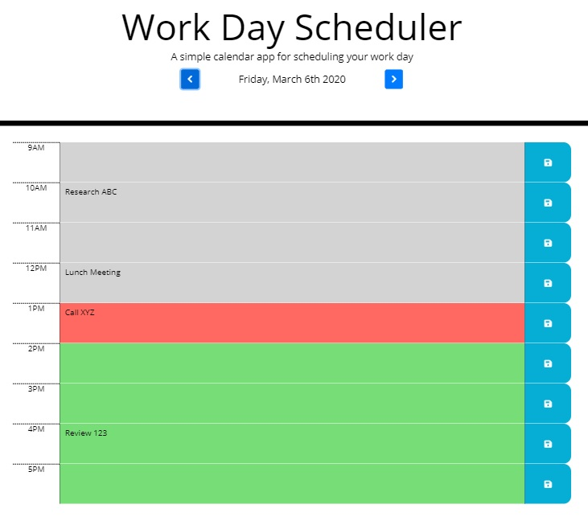
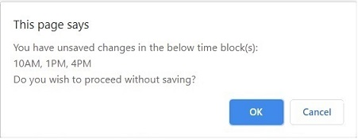

# Work Day Scheduler

Application Link: [https://gveetil.github.io/JQuery-Work-Day-Scheduler/](https://gveetil.github.io/JQuery-Work-Day-Scheduler/)

## Description
The work day scheduler is a daily planner that helps users manage their time effectively. Users have the option of saving important events for each work hour of the day, they can then view the saved events at a later point. This application uses javascript with jQuery to achieve this.

## Features
### Responsive Web Design 
This application is built using Responsive web design principles. Responsive web design provides better accessibility and an optimal viewing experience to the user, by ensuring that web pages render well on different devices and window / screen sizes. To achieve this, I have used the Bootstrap front-end component library to build my pages. 

## Functionality

When the scheduler is opened, it displays the current date at the top of the calendar. This can then be changed using the Previous and Next arrow buttons. The scheduler also displays time blocks for standard business hours 9am to 5pm. The time blocks are color coded to indicate whether they are in the past(grey), present (red), or future(green). 

* To enter a new task - click on a time block, update the task description and click the save button for that block.
* To update or remove a task - click on the given time block, make the required change and click save again. 
* When the current hour changes, the present time block(red) shifts to reflect the change.
* If the user closes and re-opens the browser, the saved tasks are displayed back on the page.
* If the user has unsaved tasks and clicks the previous or next navigation buttons, a validation message is displayed prompting the user to save the blocks that were edited:

* Selecting ok exits the page without saving changes. 
* The user can choose cancel and save changes individually using the save button.

## Known Issues / Limitations
* The work day scheduler currently assumes a standard 9-5 work day for all days of the week including saturday and sunday. 
* The current hour time block refresh is limited to the present day's time blocks and will not work on future dates / overnight.
